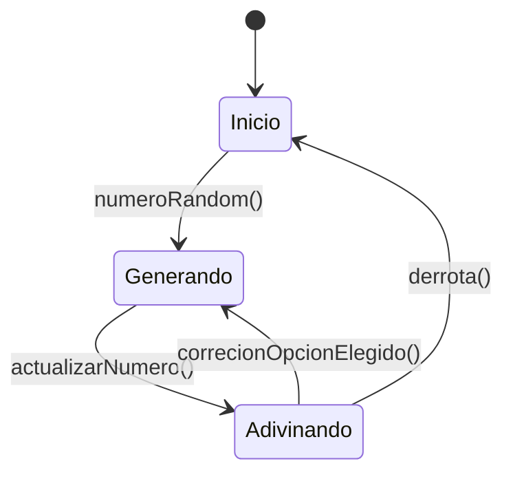

# Diagrama de estados:

```mermaid
    stateDiagram-v2
    [*] --> Inicio
    Inicio --> Generando:numeroRandom()
    Generando --> Adivinando:actualizarNumero()
    Adivinando --> Generando:correcionOpcionElegido()
    Adivinando --> Inicio:derrota()
```