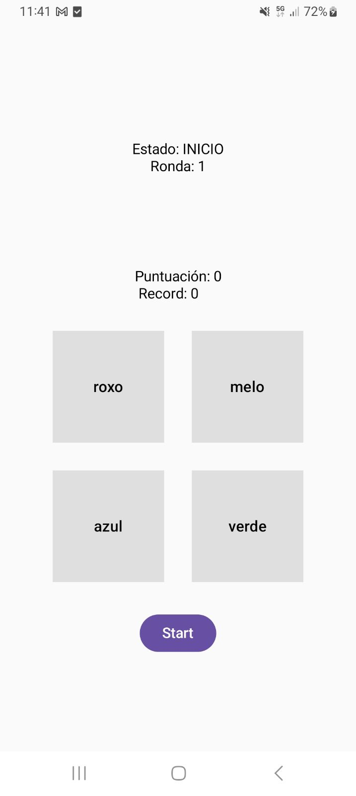
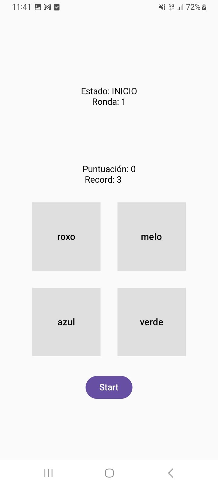
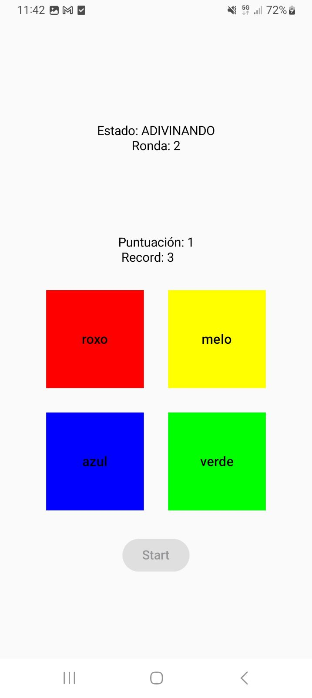
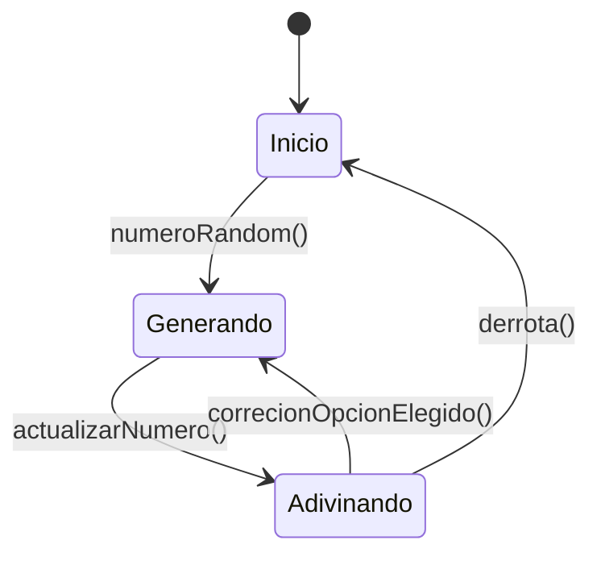

# Simón No Dice

## Oliver Miguez Alonso

## Jorge Duran Cruz

### Explicación:

Se basa en el clásico juego del simón dice, principalmente centrandonos en el uso de corrutinas y el modelo MVVM,
completamente desarrollado en ***Kotlin*** y ***JetPack Compose*** de Android Studio.

### Funcionamiento

Cuando inicias la aplicación

Cuando juegas la aplicación

Cuando pierdes en la aplicación

Cuando vuelves a jugar en la aplicación

### Diagrama de estados:

