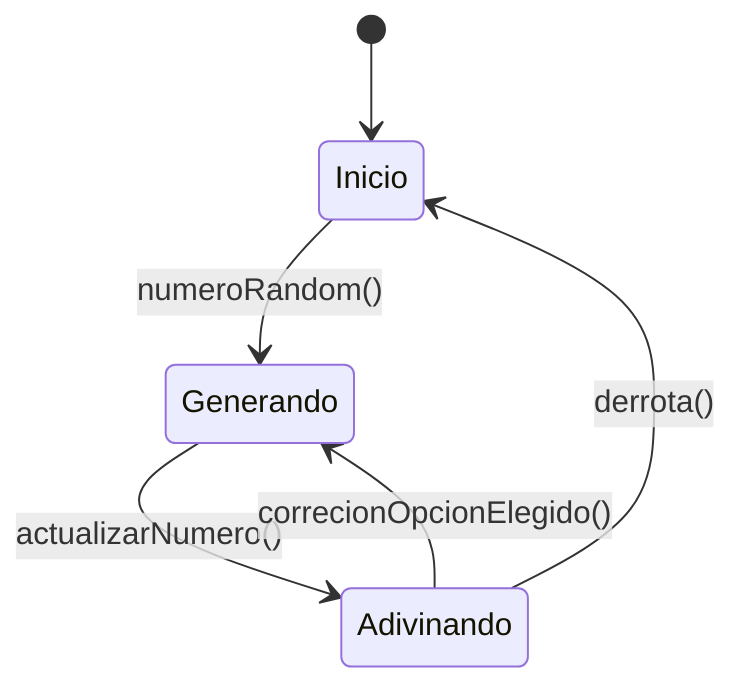

# Simón No Dice

## Oliver Miguez Alonso

## Jorge Duran Cruz

### Explicación:

Se basa en el clásico juego del simón dice, principalmente centrandonos en el uso de corrutinas y el modelo MVVM,
completamente desarrollado en ***Kotlin*** y ***JetPack Compose*** de Android Studio.

### Funcionamiento

Cuando inicias la aplicación, se verán todos los botones apagados menos el botón "start" que iniciara el juego 

Cuando juegas la aplicación, se mostraran las distintas secuencias de colores y sonidos que tendremos que adivinar, y se ira sumando puntuación

Cuando pierdes en la aplicación, se resetearan los puntos, volveremos al inicio,se actualiara el valor del record y deberemos de volver a pulsar el botón start para reiniciar el juego 

Cuando vuelves a jugar en la aplicación, genera una nueva secuencia de juego

### Justificación de diseño

Hemos decidido utilizar la corrutinas y el modelo MVVM, ya que nos proporcionan un control sobre el código ademas de una estructura organizada y concisa para programar.
Ademas hemos trabajado organizando nuestras tareas en nuestro repositorio de github a través de los commits, branchs y tags, ademas de crear  utilizar un proyecto para organizar todo.

### Proyecto

[Proyecto](https://github.com/users/oliver-miguez/projects/4)

### Diagrama de estados:

```mermaid
    stateDiagram-v2
    [*] --> Inicio
    Inicio --> Generando:numeroRandom()
    Generando --> Adivinando:actualizarNumero()
    Adivinando --> Generando:correcionOpcionElegido()
    Adivinando --> Inicio:derrota()
```

____________________

# Rooms
# Arquitectura de Datos de Simon Dice

Este documento explica cómo funciona la persistencia de datos en la aplicación, utilizando la librería **Room**, y cómo se integra con la lógica del juego y la interfaz de usuario.

## Componentes Principales

La arquitectura se divide en dos grandes carpetas:

### 1. `app/src/main/java/.../Rooms` (La Capa de Datos)

Esta carpeta contiene todo lo necesario para crear y gestionar la base de datos local.

-   **`User.kt` (La Entidad):**
    -   Es la "plantilla" o el molde de nuestros datos. Define la tabla `user` y sus columnas: `uid` (ID), `record` (puntuación) y `fecha`.

-   **`UserDao.kt` (El DAO - Data Access Object):**
    -   Es la lista de "acciones" que podemos realizar sobre la base de datos. Contiene funciones con anotaciones SQL como `@Insert`, `@Query`, `@Update`. Por ejemplo: "inserta este usuario" o "dame el usuario con el récord más alto".

-   **`AppDatabase.kt` (La Base de Datos):**
    -   Es la clase principal que representa la base de datos. Une la entidad (`User`) y las acciones (`UserDao`), configurando la base de datos de Room.

-   **`ControladorRooms.kt` (El Repositorio o Controlador):**
    -   Actúa como un **puente** entre la base de datos y el resto de la aplicación. El ViewModel habla con esta clase para no tener que conocer los detalles internos de Room.

### 2. `app/src/main/java/.../KotlinBase` (La Lógica de UI)

Esta carpeta gestiona la lógica del juego y lo que el usuario ve en pantalla.

-   **`MyViewModel.kt` (El Director de Orquesta):**
    -   Gestiona el estado del juego (la ronda, la puntuación, la secuencia, etc.).
    -   Es el único que tiene permiso para hablar con el `ControladorRooms` para pedir o guardar datos.

-   **`UI.kt` y `MainActivity.kt` (La Vista):**
    -   Son los responsables de dibujar la interfaz que ve el usuario.
    -   Reciben los datos del `MyViewModel` y le notifican cuando el usuario realiza una acción (por ejemplo, pulsar un botón).

## ¿Cómo se Conectan? (El Flujo de Datos)

La comunicación siempre sigue un orden claro para mantener la arquitectura limpia.

### Flujo al Guardar una Partida

Cuando un usuario pierde, ocurre lo siguiente:

1.  **`UI.kt`**: El usuario falla la secuencia. La vista notifica al `MyViewModel` que la partida ha terminado (llamando a la función `derrota()`).
2.  **`MyViewModel.kt`**: La función `derrota()` toma la puntuación final.
3.  **Llamada al Controlador**: `MyViewModel` llama a una función en `ControladorRooms` (por ejemplo, `actualizarRecord()` o `guardarRecord()`), pasándole la puntuación y la fecha.
4.  **`ControladorRooms.kt`**: El controlador usa su `UserDao` para ejecutar una operación `@Insert` o `@Update` en la base de datos.
5.  **`AppDatabase` (Room)**: Room se encarga de escribir los datos de forma eficiente en el almacenamiento del dispositivo.

